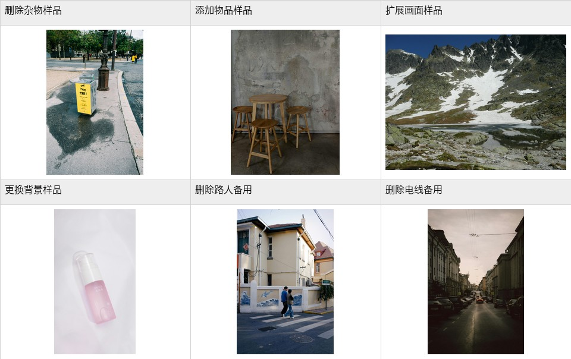
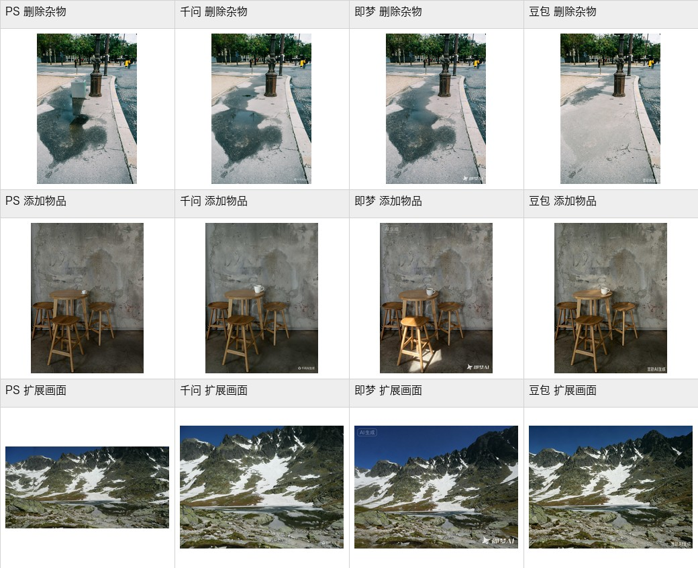

# AI-Photoshop：Photoshop 2026 创成式填充城市视觉编辑实验

本仓库公开整理了 `/Users/xuezihang/Desktop/ps创城市操作流程` 中的完整实验产出，用于记录和复现 Photoshop 2026 创成式填充在城市视觉图像编辑中的操作流程，并与千问、即梦、豆包等通用图像生成工具进行结果对照。

## 实验目标

本实验关注的不是单张图片是否“更好看”，而是生成式 AI 图像编辑工具是否适合进入专业后期工作流。主要比较维度包括：

- 分辨率保持：输出图像是否保留原图尺寸，或在扩图任务中提高画布像素规模。
- 局部控制：编辑是否集中在选区或目标区域，是否减少对无关区域的影响。
- 后期可编辑性：是否保留 PSD、生成图层、蒙版或调整图层。
- 二次编辑稳定性：是否能在不重绘整图的情况下继续修改生成内容。
- 交付适配性：是否便于作为城市视觉素材、产品图、广告图或课程论文材料继续使用。

## 仓库内容

```text
experiments/
  samples/                 # 实验样品图
  photoshop_2026/           # Photoshop 2026 操作截图、PSD、最终结果
  qwen_20260512/            # 千问生图结果
  jimeng/                   # 即梦图片生成结果
  doubao/                   # 豆包生图结果

docs/
  EXPERIMENT_PROTOCOL.md    # 完整实验操作流程
  STEP_BY_STEP_GUIDE.md     # 每一步详细操作指南
  RESULTS.md                # 结果汇总与评价指标
  FILE_MANIFEST.md          # 文件清单
  PUBLICATION_NOTES.md      # GitHub 公开注意事项
  assets/                   # README 和文档预览图

scripts/
  reconstruct_large_files.sh # 还原超过 GitHub 单文件限制的 PSD 文件
  verify_checksums.sh        # 校验文件完整性

checksums/
  LARGE_FILE_SHA256SUMS.txt  # 大文件还原后的校验值
  SHA256SUMS.txt             # 仓库文件校验值
```

## 快速查看

### 样品图



### 部分结果总览



## 大文件说明

GitHub 普通仓库不允许上传超过 100 MB 的单个文件。本实验中 `delete_object_ps2026_layered.psd` 原始大小约 163 MB，因此仓库中以分卷形式保存：

```text
experiments/photoshop_2026/01_delete_object/delete_object_ps2026_layered.psd.parts/
```

克隆仓库后，可执行以下命令还原该 PSD：

```bash
bash scripts/reconstruct_large_files.sh
```

还原后会生成：

```text
experiments/photoshop_2026/01_delete_object/delete_object_ps2026_layered.psd
```

该还原文件已被 `.gitignore` 忽略，避免再次提交超过 GitHub 限制的单文件。

## 实验流程

完整步骤见：

- [每一步详细操作指南](docs/STEP_BY_STEP_GUIDE.md)
- [完整实验操作流程](docs/EXPERIMENT_PROTOCOL.md)
- [实验结果与评价指标](docs/RESULTS.md)
- [文件清单](docs/FILE_MANIFEST.md)

## 推送到 GitHub

远程仓库：

```text
https://github.com/1922733078-lab/-AI-Photoshop-.git
```

本地推送命令：

```bash
cd /Users/xuezihang/Desktop/AI-Photoshop
git init
git add .
git commit -m "Publish Photoshop generative fill city workflow experiment"
git branch -M main
git remote add origin https://github.com/1922733078-lab/-AI-Photoshop-.git
git push -u origin main
```

如果本地已经存在 `origin`，使用：

```bash
git remote set-url origin https://github.com/1922733078-lab/-AI-Photoshop-.git
```

## 公开使用说明

本仓库包含多平台生成结果、Photoshop 操作截图和实验样品图。公开前建议阅读：

- [PUBLICATION_NOTES.md](docs/PUBLICATION_NOTES.md)

## 许可说明

- 仓库中的说明文档和脚本按 MIT License 发布。
- 图像样品、平台生成图、软件截图和 PSD 文件用于实验复现与学术展示；其使用还应遵守 Adobe、千问、即梦、豆包及相关素材来源的服务条款。
